# BMC Remedy 9.1 via REST
Notify on-call response teams when critical incidents are reported in Remedy. With the xMatters and BMC Remedy closed-loop integration, the on-call members of resolver teams are automatically notified via multiple communication channels. When the recipient responds, notes are added to the incident work log and specific incident actions may take place depending on the response.

---------

<kbd>
  
</kbd>

---------

# Table of Contents
1. [Pre-Requisites](#pre)
2. [Files](#Files)
3. [How it works](#how)
4. [Installation](#inst)
   1. [Verify Agents are Running](#agrun)
   2. [xMatters Agent Additional Setup](#xaset)
   3. [Create the xMatters Integration and Remedy Users](#ciru)
   4. [xMatters On-Demand Setup (Part 1)](#xset1)
      1. [Import the Communication Plan](#icp)
      2. [Assign permissions to the Communication Plan and Form](#apcpf)
	   3. [Get the Inbound Integration webhook URL](#giiw)
      4. [Encrypt the Remedy User password](#iris2)
   6. [xMatters On-Demand Setup (Part 2)](#xset2)
      1. [Enable Outbound Integrations](#eoi)
      2. [Configure List Property Values](#clpv)
      3. [Configure Integration Builder Endpoints](#cibe)
      4. [Configure Integration Builder Constants](#cibc1)
      5. [Review the Default Integration Builder Constants](#cibc2)
      6. [Configure REMEDY\_FORM\_INFO and REMEDY\_FORM\_CRITERIA](#crfirfc)
   7. [Remedy Setup](#rsu)
      1. [Importing workflow definition files](#riwdf)
      2. [Configuring filters](#rcf)
      3. [Configuring ITSM user](#rciu)
      4. [Disabling automatic assignment](#rdaa)
5. [Testing](#test)
6. [Troubleshooting](#tshoot)

***

# <a name="pre"></a>1. Pre-Requisites
* Version 9.1.003 and above of Remedy Incident (on-premises, or on-demand via VPN).
* Account in Remedy capable of making REST (GET/PUT/POST) calls back into Remedy Incident.
* xMatters User account - If you don't have one, [get one](https://www.xmatters.com)!
* An installation of the xMatters Agent (`v1.3.0-93` or above) installed and connected to your target xMatters instance (for secure communications between Remedy from xMatters).

    The xMatters Agent *MUST* be installed on a server (or VM) on-premises (your data center, or a VM in the cloud) that has the ability to connect to both your xMatters instance, and your Remedy instance.<br>
    
   ***THIS MUST BE DONE BEFORE ANY OTHER INSTALLATION ACTIVITIES***
    
   * Overall information about the xMatters Agent is [here](https://help.xmatters.com/ondemand/xmodwelcome/xmattersagent/xmatters-agent-topic.htm)
   * Installation instructions for the xMatters Agent is [here](https://help.xmatters.com/ondemand/xmodwelcome/xmattersagent/install-xmatters-agent.htm)  
       * Note: The You may need to update the default listening port that the xMatters Agent uses.  By default it is Port **8081**.<br>If you need to change it, you do so based on the OS type (Windows vs Linux):
           * Windows
               * You need to add a new Evironment variable called `SERVER_PORT` and set it to the port number you desire (e.g 8282).
               * You will need to restart Windows before this change will take effect.

           * Linux
               * Edit the file /etc/xmatters/xa/xa.conf
               * Add a line like this `export SERVER_PORT=8282`
               * Be sure to restart the xMatters Agent after you make that change.

# <a name="Files"></a>2. Files
The following are the files that makeup the Remedy 9 Incident integration.  Each of these are installed and configured into a combination of Remedy, the xMatters Agent, and your xMatters On-Demand instance.  The [Installation](#inst) section covers this in detail.

* [xMattersAgent.zip](xMattersAgent.zip) - Supplemental files for completing the xMatters Agent configuration.
* [xMattersOnDemand/BMCRemedyITSMIncidentREST611.zip](xMattersOnDemand/BMCRemedyITSMIncidentREST611.zip) - Remedy Incident Communication Plan (ready to be configured).
* [Remedy.zip](Remedy.zip) - This zip file containing the BMC Remedy 8.1 and above workflow definition files used to integrate changes to the Incident by the integration with xMatters.

# <a name="how"></a>3. How it works
### Information Workflow
The following diagram illustrates a standard workflow in an incident management system, and how information from the management system is passed into xMatters:
<kbd>
  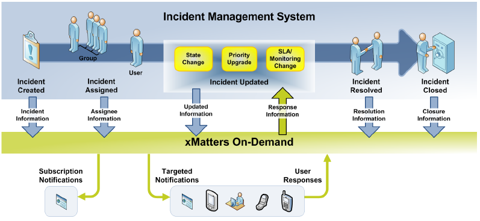
</kbd>
### Integration Workflow
Remedy triggers one of the xMatters filters as part of the integration. The filter POSTs the Remedy Incident ID to xMatters via SOAP (a Remedy limitation), and in turn xMatters uses a Remedy REST web service call to obtain the incident properties and subsequently creates the xMatters Event targeted to the assigned resolver Group.

The notified resolver responds with:

* ACCEPT - to take ownership of the incident
* IGNORE - to escalate to the next resource in the on call schedule
* COMMENT to add an independent Work Info note
* RESOLVE - to resolve the incident.

The closed loop integration annotates the incident's Work Info log with xMatters event status, notification delivery status, annotations/comments, and user responses. Additionally, an ACCEPT response assigns the user to the incident and updates the incident status to In Progress. A RESOLVE response updates the incident status to Resolved.

<details>
<summary>Click here to display a diagram that shows the relationship and data flow between the components for a typical Incident process.  A PDF version is available [here](media/RemedyIncidentRESTSequenceDiagram.pdf).</summary>
  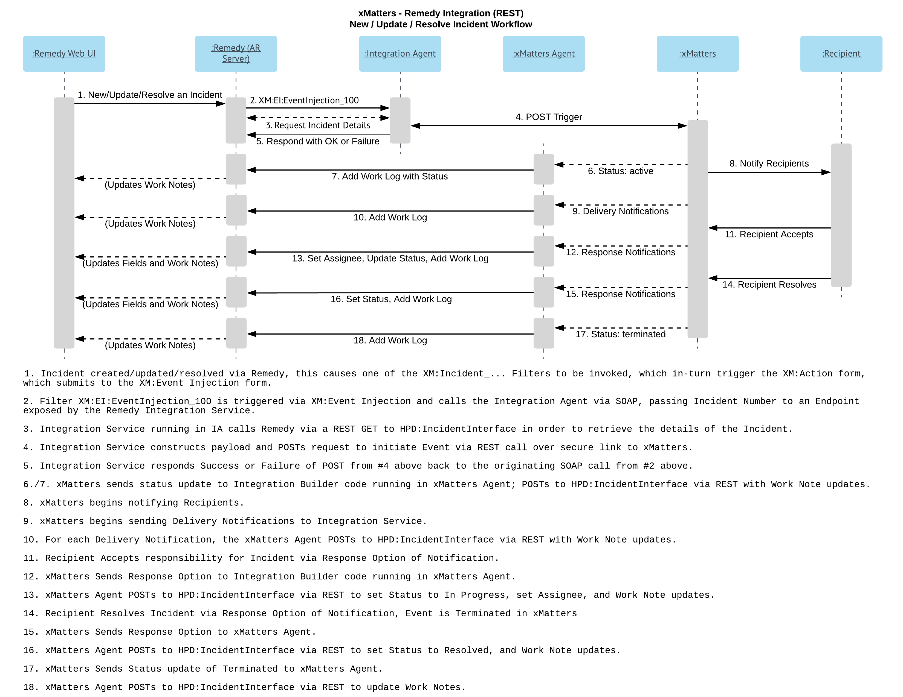
</details>


Additional details about this Integration may be found in the previous SOAP-based on-prem Integration Guide for BMC Remedy Incident [here](media/xM-BMC-Remedy_Incident_Management_5_1_2.pdf).

# <a name="inst"></a>4. Installation 

## <a name="agrun"></a>Verify Agents are Running
Before doing any installation steps for this Remedy Incident integration, it is critical to make sure that your xMatters Agent is running and visible in your environment.<br>
To view the state of the running agents:

   * Login to your xMatters instance
   * Go to the `DEVELOPER` section
   * On the left hand context menu, click on `Agents` (directly underneath `XMATTERS AGENTS`)
   * The default view on the right is called `AVAILABLE`, you need to click on the next link `INSTALLED`
      <details><summary>Click here to see an example</summary>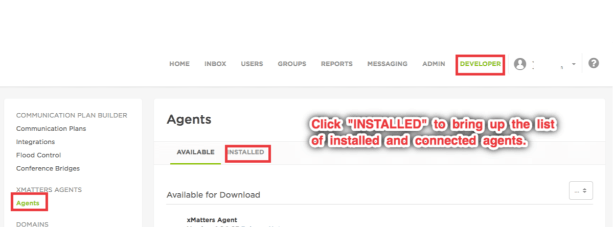</details>
   
   * After clicking `INSTALLED`, you should see a list of agents.
   * Click on the "Connected" filter in the upper right side of the display, and you should at least see one connected (green and white checkmark under STATUS) `xMatters Agent` in the upper list
      <details><summary>Click here to see an example</summary></details>


## <a name="xaset"></a>xMatters Agent Additional Setup
The integration expects to work with encrypted passwords (see the description of `REMEDY_WS_PASSWORD` in [Configure Integration Builder Constants](#cibc) below).<br>
In order for the system to decrypt that value, a special library (.jar file) needs to be added to the xMatters Agent installation.<br>
The following steps will guide you in adding this library:

1. Download the file [xMattersAgent.zip](xMattersAgent.zip) to the server where your xMatters Agent is installed and running.
2. Unzip the file into a temporary directory (e.g. C:\temp).  Check out [this article](https://support.microsoft.com/en-gb/help/4028088/windows-zip-and-unzip-files) if you need help with unzipping compressed files in Windows.

   <details><summary>Click here for examples of what you should find if you performed those operations in your C:\temp folder.</summary>
    * Unzip to C:\Temp<br><kbd>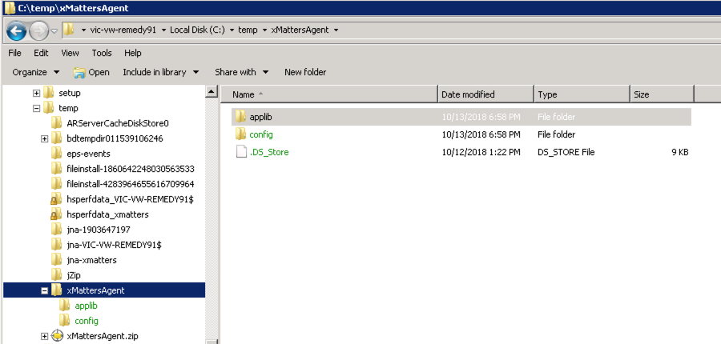</kbd>
    * Example expanding the file under C:\Temp using jZip<br><kbd>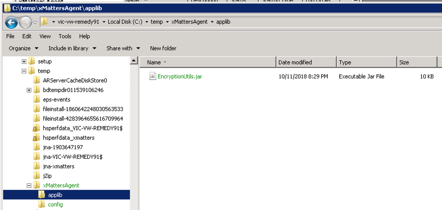</kbd>
    * Results<br><kbd>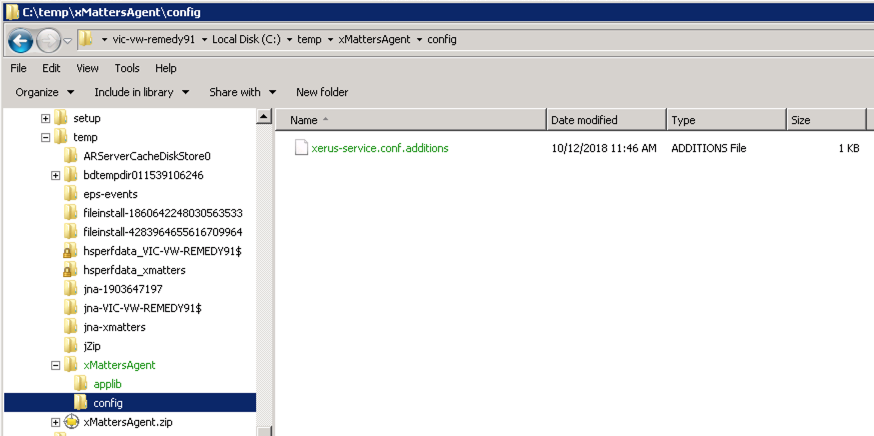</kbd><br>Contents of C:\Temp\xMattersAgent\applib<br><kbd>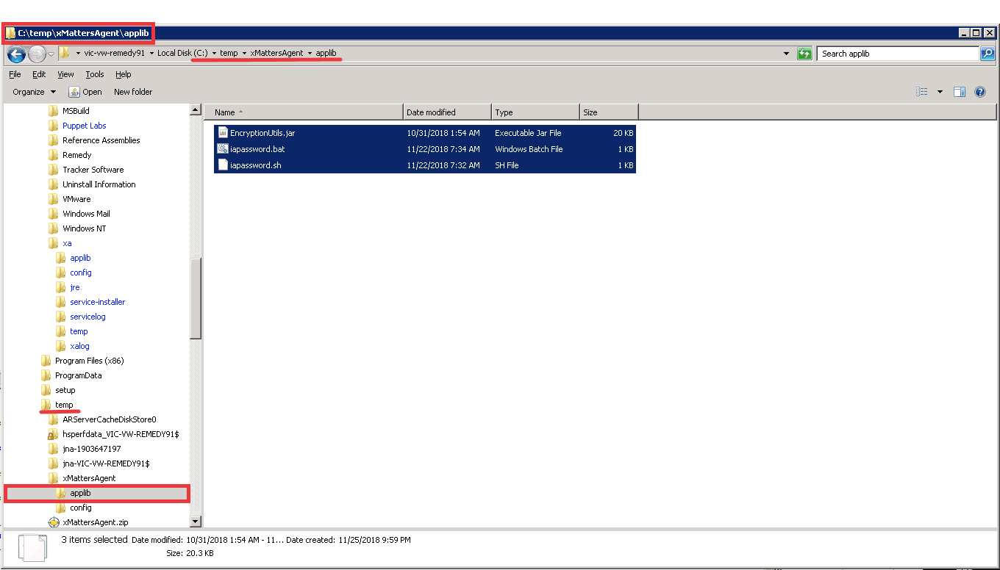</kbd><br>Contents of C:\Temp\xMattersAgent\conf<br><kbd>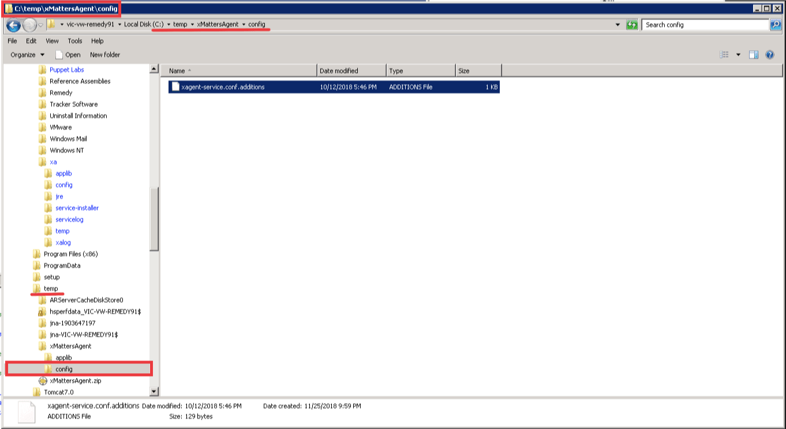</kbd>
   </details><br>

3. Move (or copy) the `EncryptionUtils.jar`, `iapassword.bat` (or `iapassword.sh` if on Linux) file to the `C:\Program Files\xa\applib` folder (or `/opt/xmatters/xa/bin` if on Linux) of your xMatters Agent installation.
   <details><summary>Click here for an example</summary>
   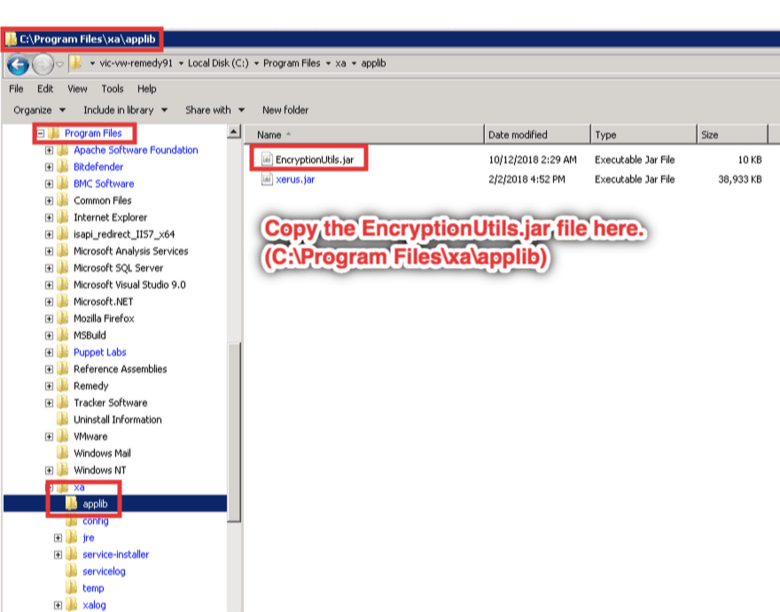
   </details>
   

4. * Under Windows, update the existing xerus-service.conf (`C:\Program Files\xa\config\xagent-service.conf`) file to refer to the new EncryptionUtils.jar file.<br>We have included a filed called `xagent-service.conf.additions` that is an example of the change you need to make to `xagent-service.conf`.
   <details><summary>Click here for an example</summary>
   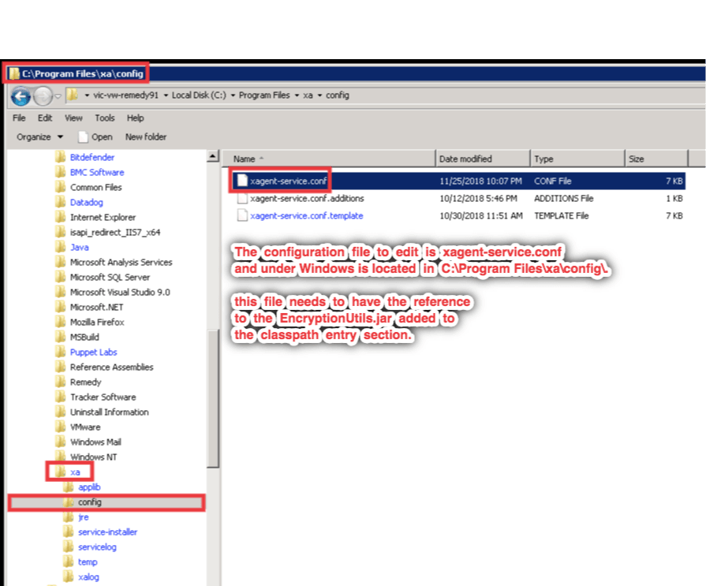
   </details>

     When you open the `xagent-service.conf` file, you will want to find the last occurence of a line beginning with `wrapper.java.classpath.nn` where `.nn` is going to be a number like 29 as the example shows here.

     ```
   wrapper.java.classpath.29=${wrapper.working.dir}\\service-installer\\lib\\xercesImpl-2.9.1.jar
   ```

     Paste the two lines from `xagent-service.conf.additions` directly after the last occurence of the line starting with `wrapper.java.classpath.nn`, and make sure that the new line has a number that is one more than the previous line.  So, if the last occurence you find is `.29`, then make the new line that refers to `EncryptionUtils.jar` have `.30`.

     ```
   # Include the xMatters Encryption utility claseses
   wrapper.java.classpath.30=${wrapper.working.dir}\\applib\\EncryptionUtils.jar
   ```

     <details><summary>Click here for an example of `xagent-service.conf` after the change has been made. `DON'T FORGET TO SAVE THIS FILE AFTER MAKING YOUR CHANGES!`</summary>
   Before:<br>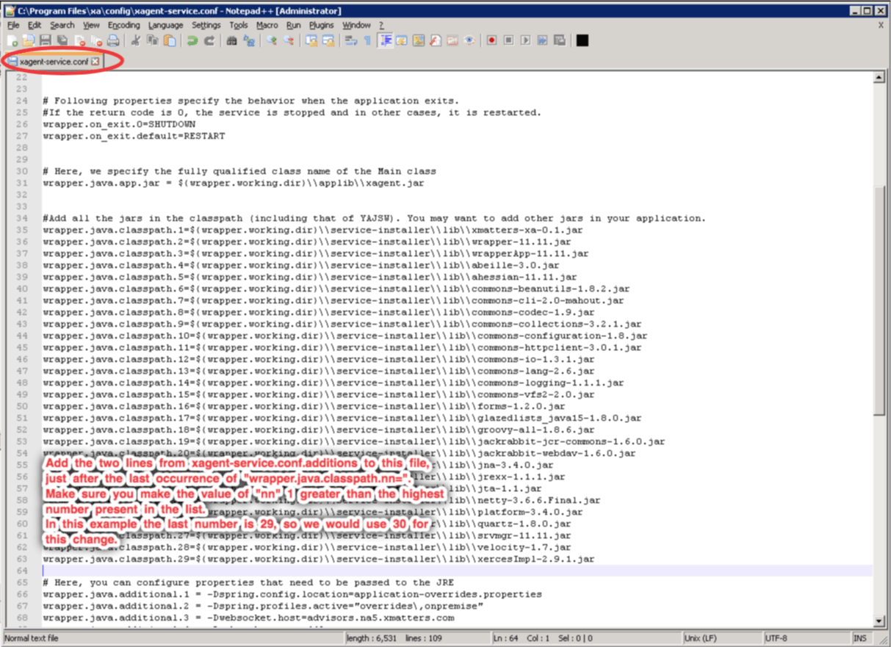<br>After:<br>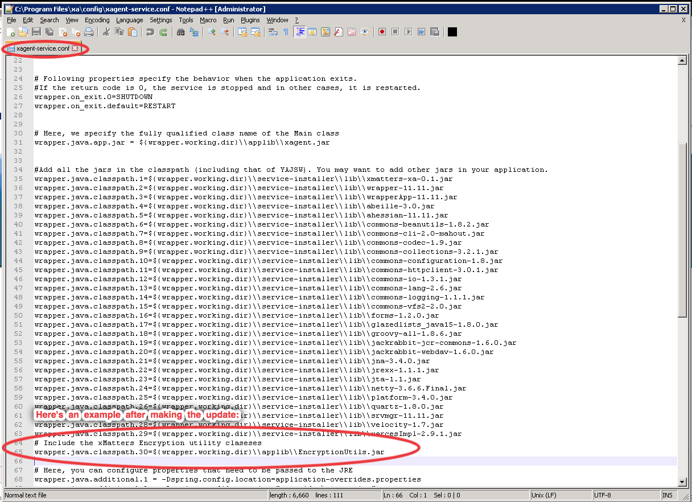
   </details>
   
   * Under Linux, we only need to update the command line arguments in `systemd.start.sh`.  This file is located under (`/opt/xmatters/xa/bin`).
   <details><summary>Click here for an example</summary>
   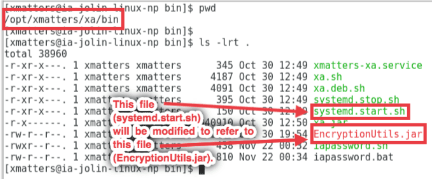
   </details>
    
     Open the `systemd.start.sh` file with your favorite editor (e.g vi), and find the line that looks like this:
    
      ```
     ${SPRINGBOOT_JAVA} -jar /opt/xmatters/xa/bin/xa.jar
      ```

     And modify the file so that it now looks like this:
    
      ```
      export CP=/opt/xmatters/xa/bin/xa.jar:/opt/xmatters/xa/bin/EncryptionUtil.jar
      export DL=-Dloader.main=com.xmatters.XAgentApplication
      ${SPRINGBOOT_JAVA} -cp ${CP} ${DL} org.springframework.boot.loader.JarLauncher
      ```
    
     Save the file, and your ready for the next step.
        
     
5. Once you have saved the changes, the last step is to restart the xMatters Agent.  This is done from the Services applet.
   <details><summary>Click here for an example in Windows</summary>
   
   </details>
   
   In Linux, you just need to issue the restart command for the service.  For example in Red Hat/CentOS you would use this command:
   
    ```
    $ service xmatters-xa restart
    ```


## <a name="ciru"></a>Create the xMatters Integration and Remedy Users
Prior to installing and configuring the xMatters Communication Plan and Remedy Integration files, it is best to create the xMatters Integration User that the Inbound and Outbound Integrations will use to authenticate back to xMatters.  And, the Remedy `Person` that the xMatters Integration will use to make REST calls into Remedy.

### <a name="crest"></a>Create an xMatters REST user account
Note, that this account needs to have two roles:

* REST Web Service User, and
* Developer

These are required as the integration makes callbacks into xMatters to initiate and control Events (requiring the "REST Web Service User" Role), and that interrogate the Communiation Plan directly (requiring the "Developer" role).

<kbd>
  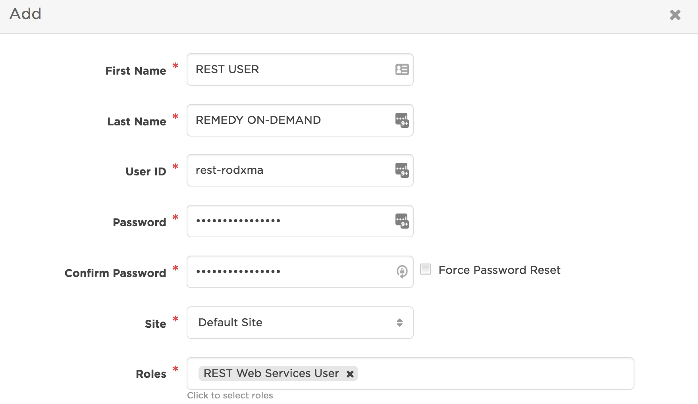
</kbd>  

### <a name="ciu"></a>Configuring ITSM user
The integration requires a dedicated ITSM user to interact with incidents.<br>
First, create a new ITSM user with the Incident Master role in BMC Remedy; the user does not need to be Support Staff.

<kbd>
  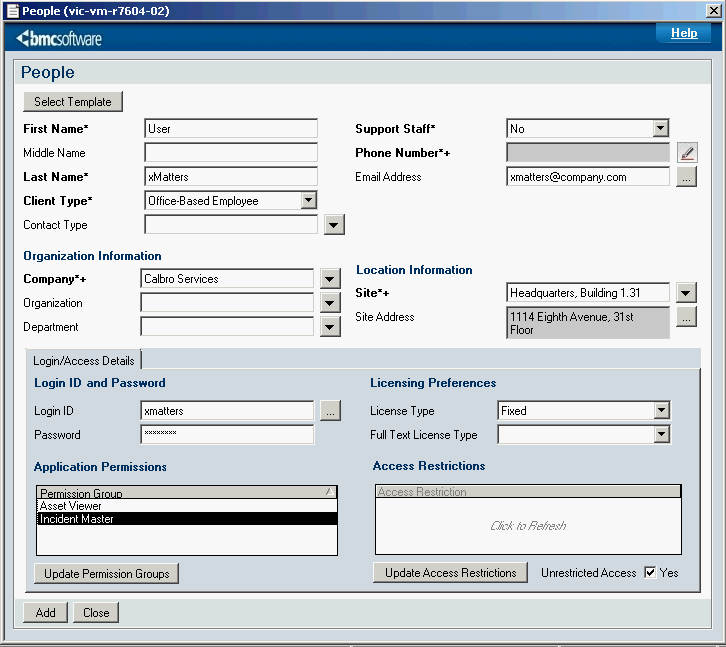
</kbd>

## <a name="xset1"></a>xMatters Setup (Part 1)
### <a name="icp"></a>Import the Communication Plan
* Import the "BMC Remedy ITSM - Incident - REST - v6.1.1" Communication Plan [BMCRemedyITSMIncidentREST.zip](BMCRemedyITSMIncidentREST.zip).
Instructions on Importing Communication Plans are [here](http://help.xmatters.com/OnDemand/xmodwelcome/communicationplanbuilder/exportcommplan.htm).

### <a name="apcpf"></a>Assign permissions to the Communication Plan and Form  
* On the Communication Plans page, click the Edit drop-down menu for the "BMC Remedy ITSM - Incident - REST - v6.1.1" Communication Plan then select Access Permissions
* Add the REST User
* On the Communication Plans page, click the Edit drop-down menu for the "BMC Remedy ITSM - Incident - REST - v6.1.1" Communication Plan then select Forms
* Click the Mobile and Web Service drop-down menu for the Incident Alerts form
* Select Sender Permissions then add the REST User

### <a name="giiw"></a>Get the Inbound Integration webhook URL
Before we can install and configure the Remedy Integration Service into the xMatters Integration Agent, we also need to collect the URL (Webhook address) for the Inbound Integration that is called on behalf of Remedy when an Incident requires xMatters to notify folks.

* On the Communication Plans page, click the Edit drop-down menu for the "**BMC Remedy ITSM - Incident - REST - v6.1.1**" communication plan then select Integration Builder
   <details><summary>Click here for an example</summary>
   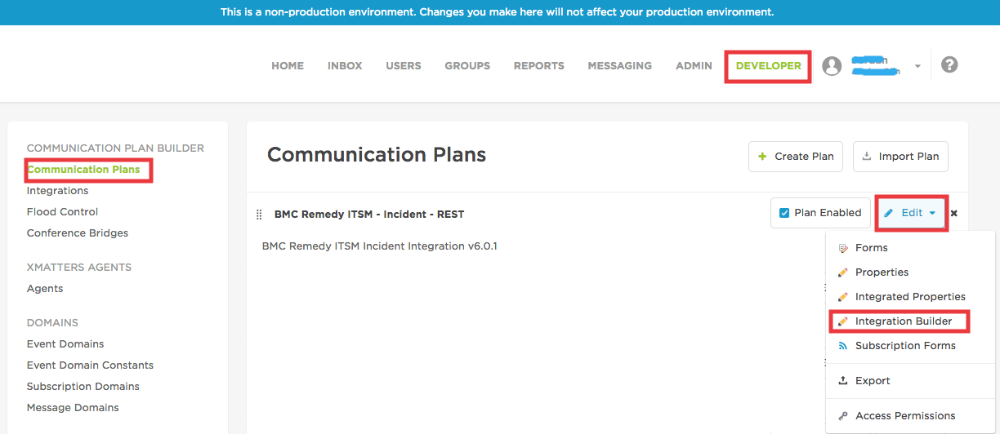
   </details>
   
* Click the "**3 Configured**" link (blue text) to the right of Inbound Integrations
   <details><summary>Click here for an example</summary>
   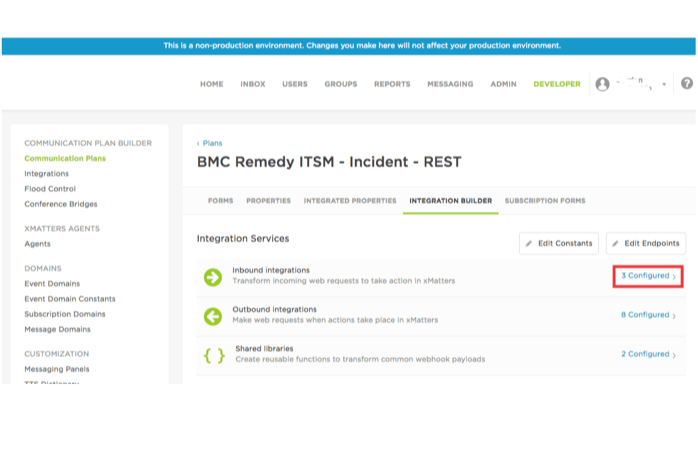
   </details>

* Click the "**Trigger Remedy Alert - From xMatters Agent**" link (blue text)
   <details><summary>Click here for an example</summary>
   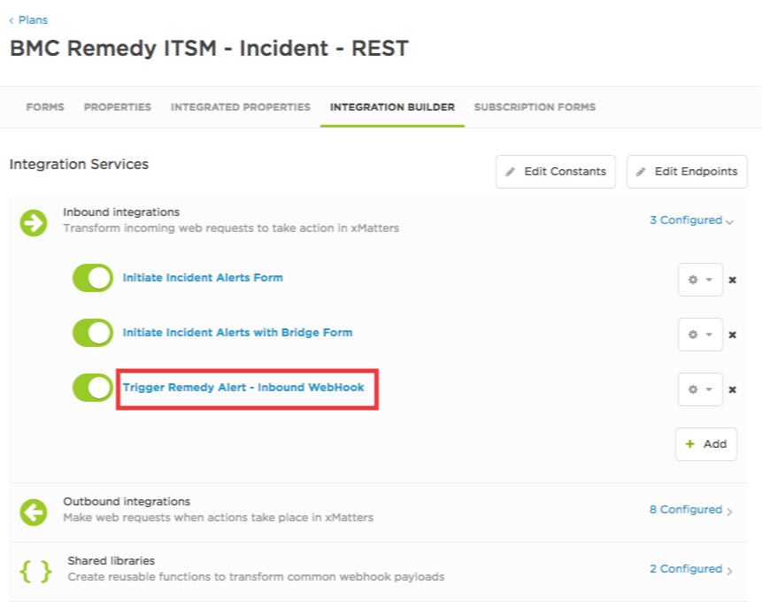
   </details>

* Choose the xMatters Agent that will be handling the inbound requests to this endpoint (from Remedy) by clicking on the checkbox to the left of the xMatters Agent's identifier.
   <details><summary>Click here for an example</summary>
   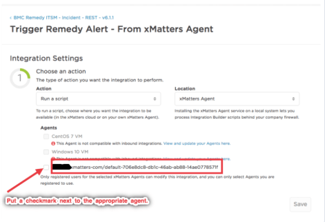
   </details>

* The screen will expand, and the Save button in the bottom right corner will turn blue.  Click the Save button.
   <details><summary>Click here for an example</summary>
   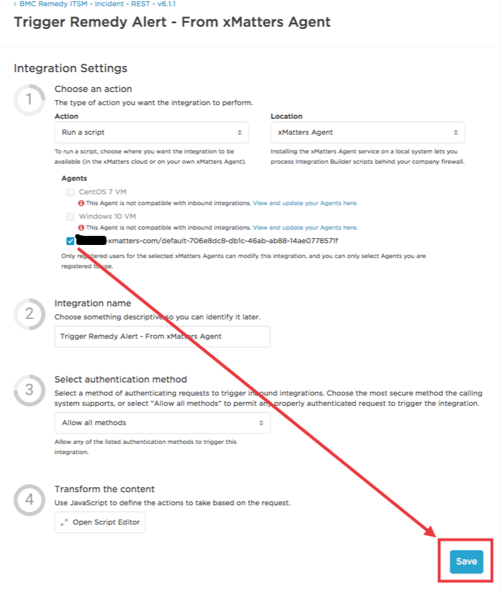
   </details>
   
   NOTE: Depending on the version of the xMatters Agent you are connecting to, you may see the following warning.  If you do, just click OK and restart the xMatters Agent.<br>
   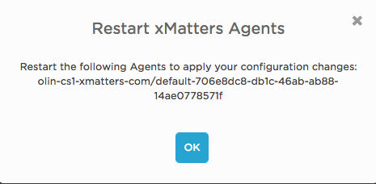

* Scroll to the **How to trigger the integration** section, and click on "**Select Method**", and then "**URL Authentication**".
   <details><summary>Click here for an example</summary>
   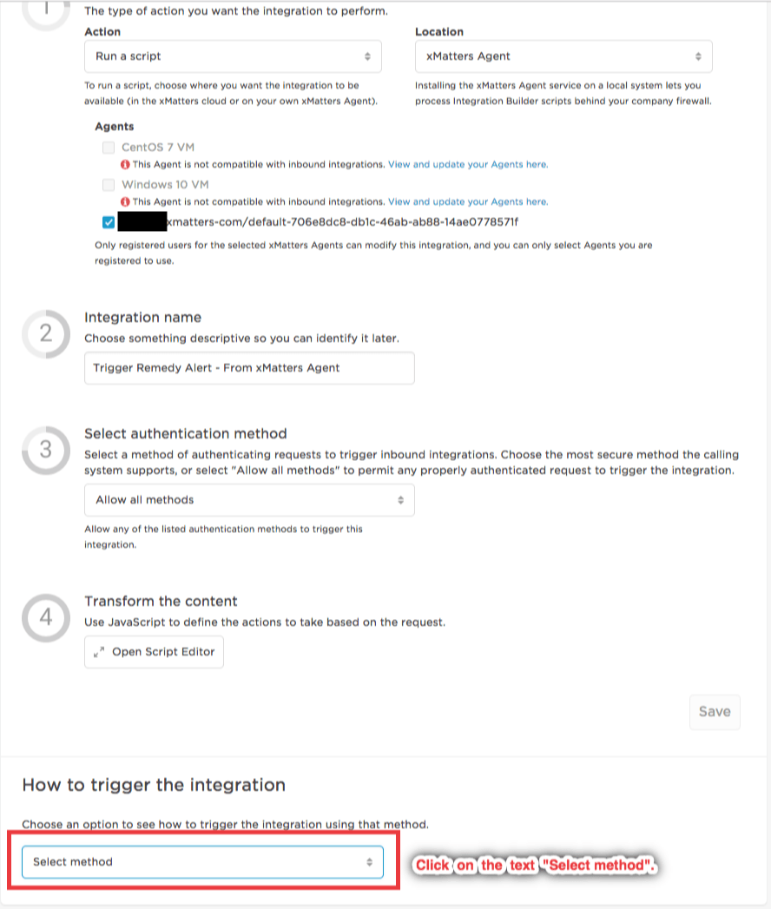<br>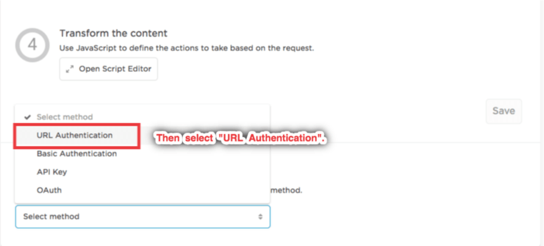
   </details>

* In the Authenticating User field, find and select the Integration User that was created in the step [Create an xMatters REST user account](#crest).<br>Then click the *Copy Url* link to the right of the Trigger, and save that value in a text file to use later on when setting up the Remedy Filter that will be calling this Inbound Integration in `Configuring Filters` [below](#rcf)
   <details><summary>Click here for an example</summary>
   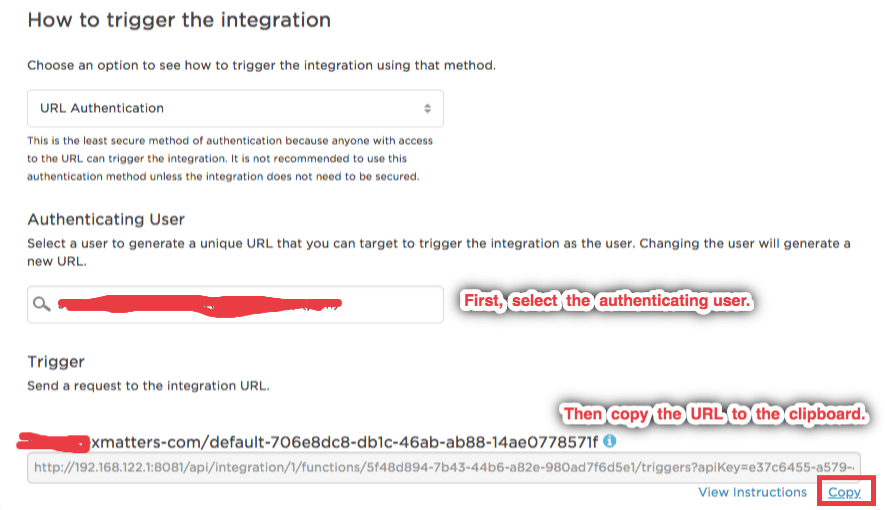
   </details>

* Now we need to enable the Inbound Integration in order to be able to receive inbound requests.The final step is to now go back and enable the integration.
    * Click on the blue breadcrump near the top of the page above "Trigger Remedy Alert - From xMatters Agent" that has "< BMC Remedy ITSM - Incident - REST - v6.1.1" in blue writing.  This will take you back to the "3 Configured" Inbound Integrations.
    * Notice that the "Trigger Remedy Alert - From xMatters Agent" Inbound Integration is disabled.
       <details><summary>Click here for an example</summary>
       3 Configured before enabling "Trigger Remedy Alert - From xMatters Agent"<br>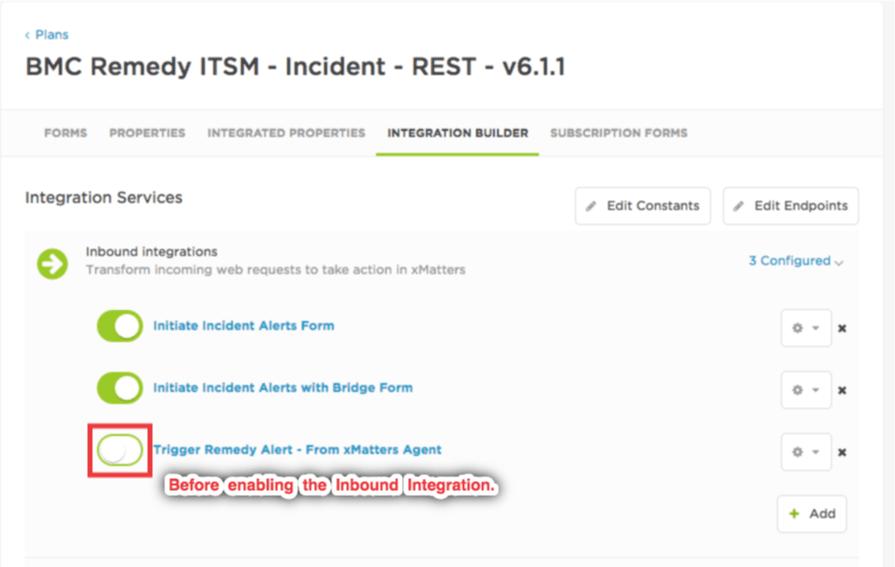
       </details>
    * Click and slide the button to the right to enable the "Trigger Remedy Alert - From xMatters Agent" Integration.
       <details><summary>Click here for an example</summary>
       3 Configured after enabling "Trigger Remedy Alert - From xMatters Agent"<br>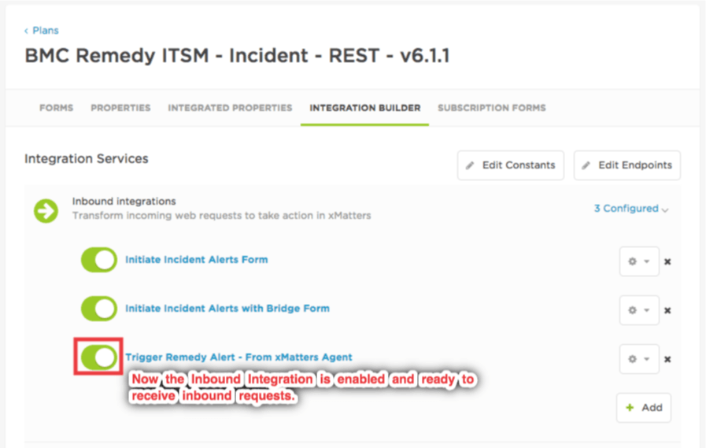
       </details>

### <a name="iris2"></a>Encrypt the Remedy User password
This integration includes a utility that is required to encrypt the password that will be used for sending REST calls to Remedy.  That utility is called `iapassword.bat` (Windows) or `iapassword.sh` (Linux), and was installed with the EncryptionUtils.jar [previously](#xaset).<br>The documentation for the `iapassword.bat | iapassword.sh` utility is located [here](https://help.xmatters.com/ondemand/iaguide/iapasswordutility.htm).<br>As an example, here are the steps to create the encrypted password under Windows.

1. Open up a Windows Command Prompt, and change directory to your xMatters Agent's `bin\` folder (or wherever you put EncryptionUtils.jar and iapassword.bat).  Typically this would be C:\Program Files\xa\applib.
2. If you do a `dir` command, you will see the contents, including the `iapassword.bat` utility.
3. Typing in the command name and pressing Enter will show you the command usage.
   <details><summary>Click here for an example</summary>
   <kbd>
   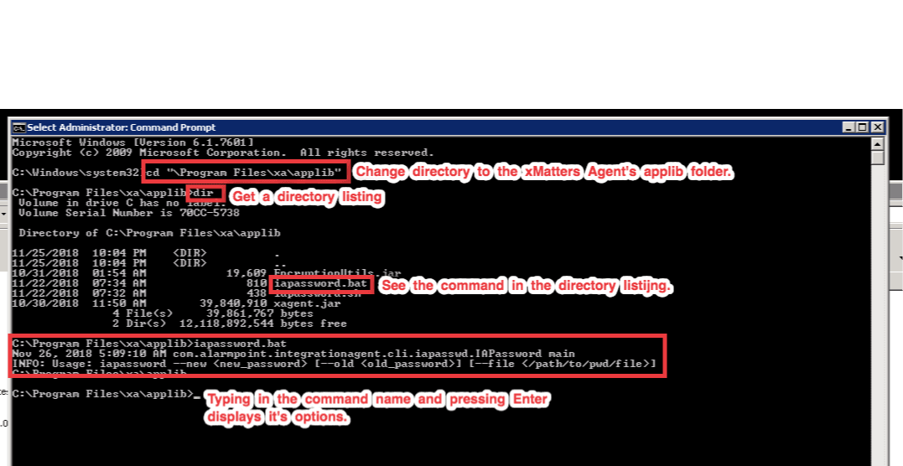
   </kbd>
   </details>
   
4. The format for the "iapassword" command we can use to create the encrypted password for the Remedy 9 Incident User we created previoustly (e.g. "xmatters"), is as follows:<br>`iapassword --new <password> --file <relative-path-and-name>`.<br>The actual command would look something like this:<br>`iapassword --new Remedy9! --file rem_rest_users.pwd`<br>In this example, the unencrypted password is `Remedy9!` with the encrypted version in `rem_rest_user.pwd` is `R5UMpF4Zeb2aM/8Sn+jqiw==`.
   <details><summary>Click here to display a screenshot of creating this file in the current (applib) directory.  There is a before and after view of the directory, as well as the command we ran to create the encrypted file, as well as a display of the encrypted value.  Note: IGNORE the message about needing to "...restart the Integration Agent..."</summary>
   <kbd>
   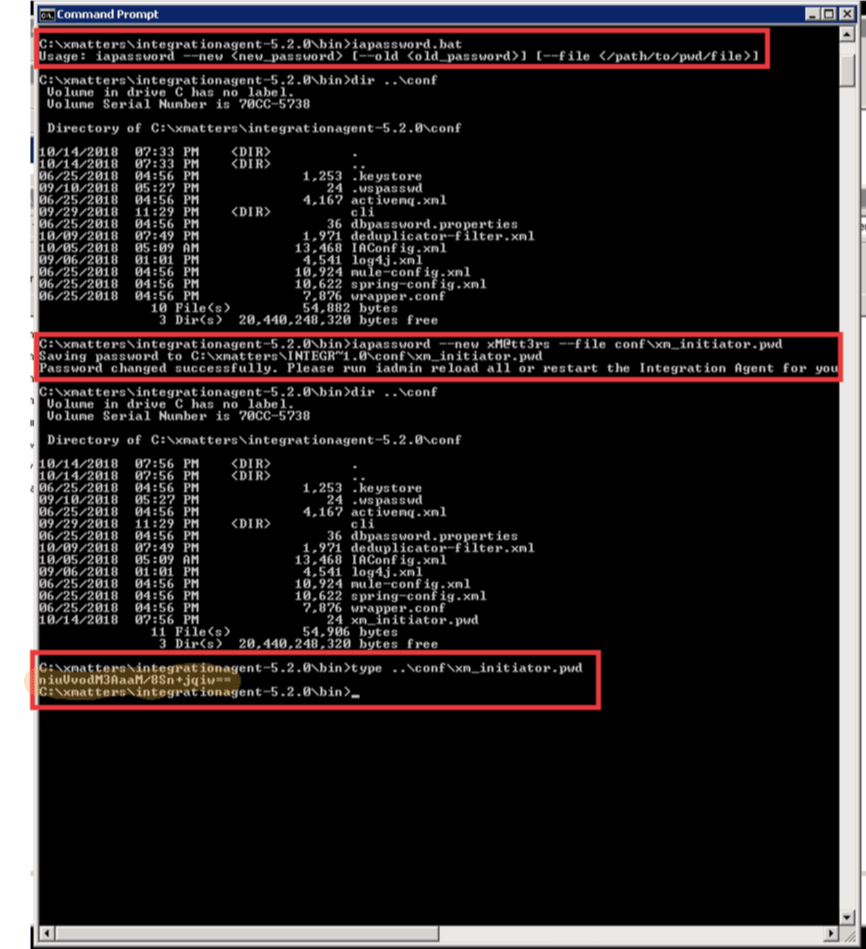
   </kbd>
   </details>
   
5. Copy the contents of the `rem_rest_user.pwd` file (the encrypted password) to a notepad temporarily as you will need it later when setting the value for `REMEDY_WS_PASSWORD` in [Configure Integration Builder Constants](#cibc1) below.<br>FYI: You can use the `type rem_rest_user.pwd` command under Windows, or the `cat rem_rest_user.pwd` command under Linux to see the contents of the file. 


## <a name="xset2"></a>xMatters Setup (Part 2)
### <a name="eoi"></a>Enable Outbound Integrations
As was seen with the Inbound Integration, when you first load a Communication Plan that has Outbound Integrations configured to use the xMatters Agent, those Outbound Integrations come up as disabled.  This is because you have to tell xMatters On-Demand, which xMatters Agent (or Agents) you would like those Outbound Integrations to run on.

Here is how to Enable an Outbound Integration, and point it to a specific xMatters Agent.<br>**Note: You will need to perform the following steps for each of the 8 Outbound Integrations.**

* On the Communication Plans page, click the Edit drop-down menu for the "**BMC Remedy ITSM - Incident - REST - v6.1.1**" communication plan then select Integration Builder
   <details><summary>Click here for an example</summary>
   
   </details>

* Click the *8 Configured* link (blue text) to the right of Outbound Integrations
   <details><summary>Click here for an example</summary>
   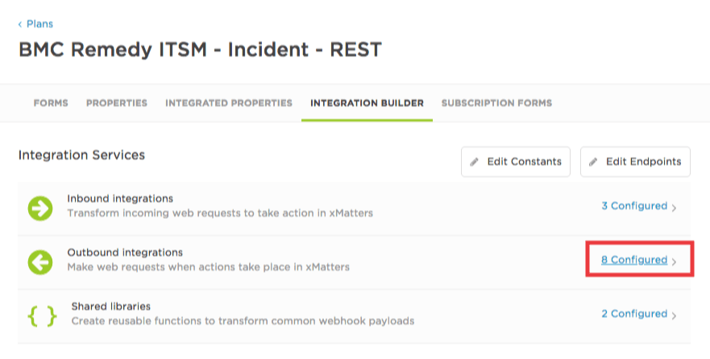
   </details>

* Click on any of the eight Outbound Integrations links (blue text), for example "**Incident Alerts - Device Delivery Updates**"<br>Notice that the toggle switch to the left of each name is white, instead of green, signifying that it is disabled.
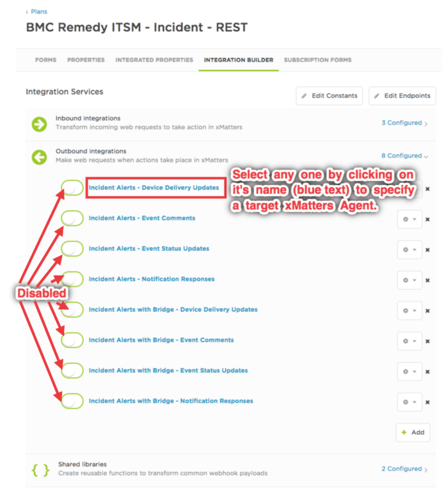

* Select (click on the checkbox) the xMatters Agent that you want the Oubtound Integrations to run on.
   <details><summary>Click here for an example</summary>
   
   </details>

* After Selecting you'll be able to Update the integration by clicking on the "Update Outbound Integration" button
   <details><summary>Click here for an example</summary>
   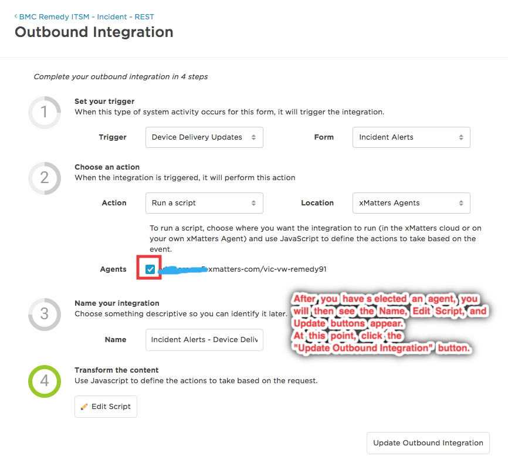
   </details>

* You may be presented with a warning telling you to restart the xMatters Agent.  That is normal, and you should defer until you have enabled all eight Outbound Integrations.  This is a requirement as it ensures that the user who enabled the integrations was authorized to do so by the agent.  This is a one time activity.
   <details><summary>Click here for an example</summary>
   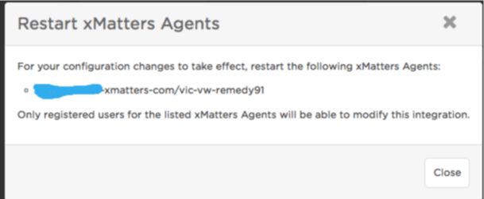
   </details>

* Click on the "*BMC Remedy ITSM - Incident - REST - v6.1.1*" breadcrumb at the top of the page to go back
   <details><summary>Click here for an example</summary>
   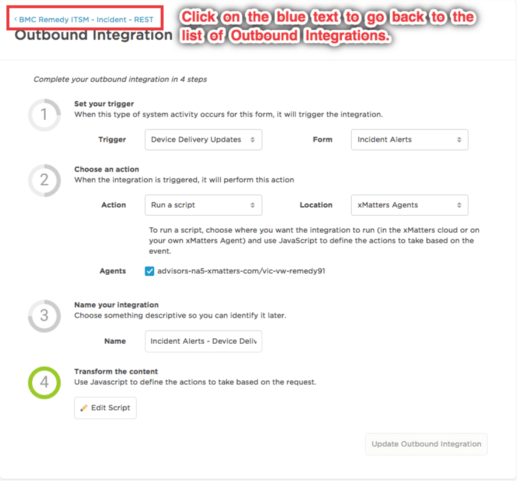
   </details>

* After all eight are enabled, your list of Outbound Integrations should look like this.
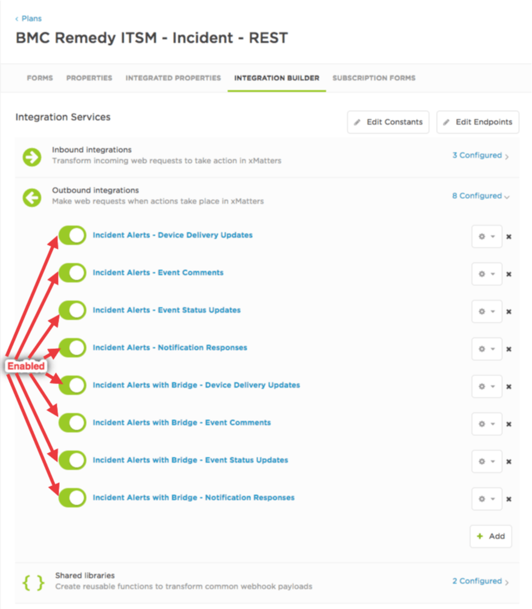

* Finally, Restart the xMatters Agent that we just pointed all of those Outbound Integrations at.<br>This is done from the Services applet back on the Server/VM hosting the xMatters Agent.
   <details><summary>Click here for an example</summary>
   
   </details>

### <a name="clpv"></a>Configure List Property Values  
* On the Communication Plans page, click the Edit drop-down menu for the "BMC Remedy ITSM - Incident - REST - v6.1.1" Communication Plan then select `Properties` from the sub-menu. 
* Verify/Edit the following list of Property values:  
   * Company  
   * Contact\_Sensitivity  
   * Escalated  
   * Impact  
   * Priority  
   * Reported\_Source  
   * SLM_Status  
   * Service\_Type  
   * Status  
   * Status\_Reason  
   * Urgency  
   * VIP

### <a name="cibe"></a>Configure Integration Builder Endpoints  
* On the Communication Plans page, click the Edit drop-down menu for the "BMC Remedy ITSM - Incident - REST - v6.1.1" Communication Plan then select Integration Builder
* Click the "Edit Endpoints" button
* For the `xMatters` endpoint, in Assign Endpoint add the REST User from above (e.g. svc-rest-remedy-incident), then Save Changes
* For the `RemedyRESTAPI` endpoint, type the Base URL for the Remedy environment's REST Web Service address (e.g. https://remedyServer:8443), then Save Changes.<br>NOTE: This address needs to be reachable by the xMatters Agent.
* Close Edit Endpoints  

### <a name="cibc1"></a>Configure Integration Builder Constants
Note: There are many Constants defined in the Communication Plan (and described below), but only the ones that are environment specific need to be configured.  Those will have an asterisk (*) in front of their name.

* On the Communication Plans page, click the Edit drop-down menu for the "BMC Remedy ITSM - Incident - REST - v6.1.1" Communication Plan then select Integration Builder
* Click the "Edit Constants" button
* Edit these constants to match your environment (used by the scripts in the Communication Plan, and the "Remedy Rest Util" Shared Library)
   
| Constant               | Description                                                                |
|:---------------------- |:-------------------------------------------------------------------------- |
| `* REMEDY_FORM_CRITERIA` | JSON Array containing objects with property values that when matched cause a particular form to be used. (This object is dependent on the constant `REMEDY_FORM_INFO`.  See specific configuration instructions for both below). |
| `* REMEDY_FORM_INFO` | JSON Object representing the FORMs in this Communication Plan, their name and trigger URL. (This values in this object are used by the constant `REMEDY_FORM_CRITERIA`.  See specific configuration instructions for both below). |
| `* REMEDY_FQDN` | The fully qualified domain name AND port of the Remedy Mid Tier server that provides the Remedy Web User Interface.  Typically this is on port 8080. |
| `* REMEDY_SERVER_NAME` | The logical server name to target in Remedy. |
| `* REMEDY_WS_PASSWORD` | The Remedy API user's encrypted password.<br>Note: This is created using the iapassword.bat / iapassword.sh utility (originally from the xMatters Integration Agent.  See the instruction [here](https://help.xmatters.com/ondemand/iaguide/iapasswordutility.htm).  Once the file is created, open it up in any text editor and paste the contents into this value. |
| `* REMEDY_WS_USERNAME` | Login ID of the Remedy User that will be making API calls. (The default is "xmatters".) |

### <a name="cibc2"></a>Review the Default Integration Builder Constants
Note: There are many Constants defined in the Communication Plan (and described below), but only the ones that are environment specific need to be configured.  Those will have an asterisk (*) in front of their name.

* On the Communication Plans page, click the Edit drop-down menu for the "BMC Remedy ITSM - Incident - REST - v6.1.1" Communication Plan then select Integration Builder
* Click the "Edit Constants" button
* Review these constants used by the scripts in the Communication Plan, and the "Remedy Rest Util" Shared Library.  They all have default values that are suitable for getting started.
   
| Constant               | Description                                                                |
|:---------------------- |:-------------------------------------------------------------------------- |
| `REMEDY_ENDPOINT` | The name of the xMatters endpoint object to use for calls to Remedy. (The default is "RemedyRESTAPI".) |
| `REMEDY_NOTE_PREFIX` | Text that is placed in-front of all Work Notes. (The default is "[xMatters] -".) |
| `REMEDY_OPT_ADD_JSON_HEADER` | If true, include the "Conent-Type: application/json" HTTP request header.<br>Note: This should be false if scripts are running in the xMatters Agent. (The default is false.) |
| `REMEDY_OPT_ANNOTATE_NOTIFICATION_REQUEST_ID` | If true, will add a work note showing the Inbound Integration Request ID related to the submitted notification request. (The default is true.) |
| `REMEDY_OPT_ANNOTATE_NUM_DELETED` | If true, will add a work note showing number of related xMatters Events terminated when an Incident is Downgraded or Manually Resolved. (The default is true.) |
| `REMEDY_OPT_DEL_EXISTING_EVENTS` | If true, delete existing active xMatters Events prior to injection. (The default is true.) |
| `REMEDY_OPT_MOCK_ENABLED [OPTIONAL]` | If exists, and the value is true, then export the mocked functions and variables. |
| `REMEDY_OPT_SIMPLE_GROUP_NAME` | If true, construct the xMatters target group name as just whatever value is in "Assigned_Group" vs. concatonating all Support Group name qualifiers "Support Company\*Support Organization\*Assigned\_Group" .  For example, "Desktop Support" vs "Calbro Services\*IT Support\*Desktop Support". (The default is true.)|
| `REMEDY_REQUEST_ACTION_ADD` | Text of the action request for an Event Add request from Remedy. (The default is "ADD".) |
| `REMEDY_REQUEST_ACTION_DELETE` | Text of the action request for an Event Deletion request from Remedy (The default is "DELETE".) |
| `REMEDY_RESOLVED_RESOLUTION` | Description set in the Resolution field when the "Resolve" Response Option is taken. (Default is "Ticket resolved via xMatters notification response".) |
| `REMEDY_RESOLVED_RESOLUTION_METHOD` | Method set in the Resolution Method field when the "Resolve" Response Option is taken. (Default is "Self-Service".) |
| `REMEDY_STATUS_IN_PROGRESS` | Value put into the Status field upon Accept (default is "In Progress", but must map to a value that is configured in your Remedy instance). |
| `REMEDY_STATUS_REASON` | Value entered into the Status_Reason field upon Resolution (The default is "No Further Action Required".) |
| `REMEDY_STATUS_RESOLVED` | Value put into the Status field upon Resolution (default is "Resolved", but must map to a value that is configured in your Remedy instance). |
| `RESPONSE_ACTION_ACCEPT` | Response Option representing Accept (default is "accept"). |
| `RESPONSE_ACTION_ACK` | Response Option representing Acknowledgement (short) (default is "ack"). |
| `RESPONSE_ACTION_ACKNOWLEDGE` | Response Option representing Acknowledgement (full) (default is "acknowledge"). |
| `RESPONSE_ACTION_ANNOTATE` | Response Option representing Annotate (same result as comment) (default is "annotate"). |
| `RESPONSE_ACTION_COMMENT` | Response Option representing Comment (default is "comment"). |
| `RESPONSE_ACTION_IGNORE` | Response Option representing Ignore (Escalate) (default is "ignore"). |
| `RESPONSE_ACTION_JOIN` | Response Option representing Join (Conference Bridge Only) (default is "join"). |
| `RESPONSE_ACTION_RESOLVE` | Response Option representing Resolve/Resolution (default is "resolve"). |


### <a name="crfirfc"></a>Configure REMEDY\_FORM\_INFO and REMEDY\_FORM\_CRITERIA
The ability to choose and route incoming requests from Remedy to a particular Form based on the need (or not) for a Conference Bridge is performed dynamically by the Inbound Integration and controlled by two constants: `REMEDY_FORM_INFO` and `REMEDY_FORM_CRITERIA`.

#### Configure REMEDY\_FORM\_INFO
`REMEDY_FORM_INFO` is used to hold the information on the Forms and their Inbound Integration entry points.  The out-of-the-box configuration contains two Forms ("Incident Alerts", and "Incident Alerts with Bridge") that have corresponding Inbound Integration entry points/web hooks ("Initiate Incident Alerts Form", and "Initiate Incident Alerts with Bridge Form" respectively).
The contents of this constant is a JSON (JavaScript Object Notation) array of objects, each representing information about one of these Forms.
Each element has a particular format and fields.  The only two fields of each element that you will need to configure are the `"triggerURL"` and `"URLUser"` fields.  They represent the Inbound Integration address and the user that will be authenticating to call that trigger.
Here is the out-of-the-box, unconfigured version of `REMEDY_FORM_INFO`.

   ```javascript
[
  {
    "pos": 0,
    "planName": "BMC Remedy ITSM - Incident - REST - v6.1.1",
    "formName": "Incident Alerts",
    "userResponseOptions":"Accept,Comment,Resolve",
    "groupResponseOptions":"Accept,Ignore,Comment,Resolve",
    "triggerURL": "<TO-BE-FILLED-IN-BASED-ON-INBOUND-INTEGRATION>",
    "URLUser": "<YOUR-XMATTERS-REMEDY-REST-USER>"
  },
  {
    "pos": 1,
    "planName": "BMC Remedy ITSM - Incident - REST - v6.1.1",
    "formName": "Incident Alerts with Bridge",
    "userResponseOptions":"Accept,Join,Comment,Resolve",
    "groupResponseOptions":"Accept,Ignore,Join,Comment,Resolve",
    "triggerURL": "<TO-BE-FILLED-IN-BASED-ON-INBOUND-INTEGRATION>",
    "URLUser": "<YOUR-XMATTERS-REMEDY-REST-USER>"
  }
]
   ```

The value to put into `"URLUser"` is simply the xMatters User ID for the REST User that you created previously (e.g. "svc-rest-remedy-incident").

Here is how we lookup the values to put into the "triggerURL":

* On the Communication Plans page, click the Edit drop-down menu for the "**BMC Remedy ITSM - Incident - REST - v6.1.1**" communication plan then select Integration Builder
   <details><summary>Click here for an example</summary>
   
   </details>

* Click the "**3 Configured**" link (blue text) to the right of Inbound Integrations
   <details><summary>Click here for an example</summary>
   
   </details>

* Click the "**Initiate Incident Alerts Form**" link (blue text)
   <details><summary>Click here for an example</summary>
   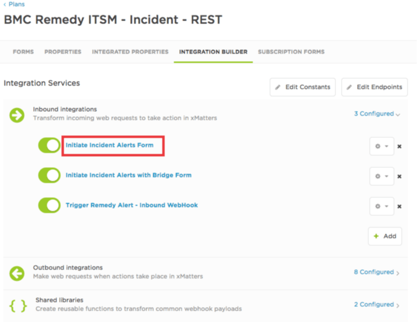
   </details>

* Scroll down to the "**How to trigger the integration**" section
   <details><summary>Click here for an example</summary>
   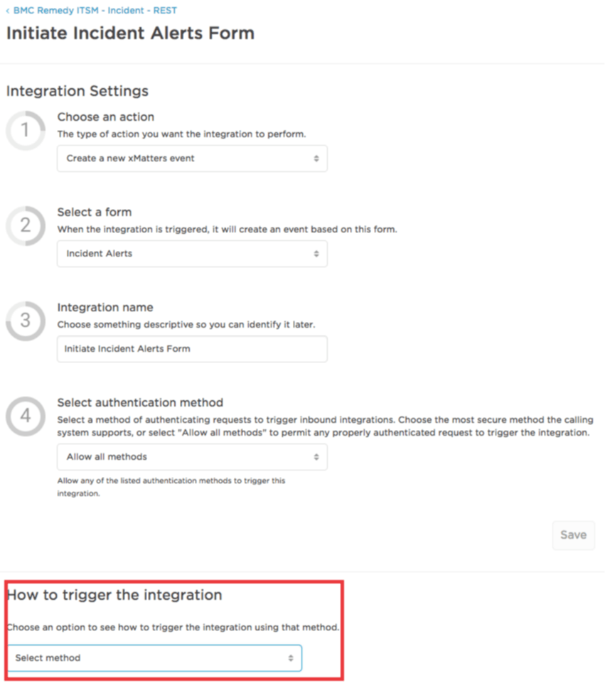
   </details>

* Select "**URL Authentication**" for the method
   <details><summary>Click here for an example</summary>
   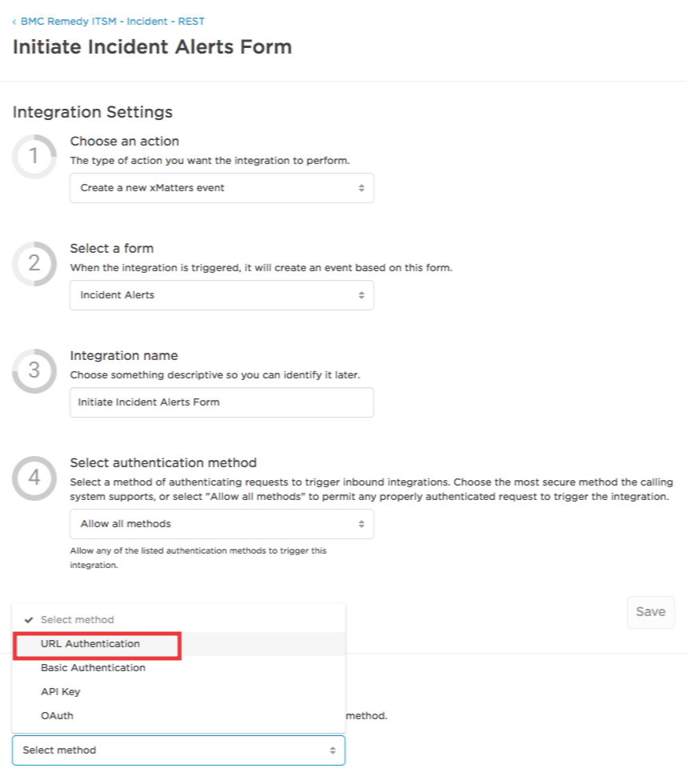
   </details>

* Find the REST User you created above and select it in Authenticating User field, then click the "**Copy**" link in the lower right side of the displayed Trigger URL
   <details><summary>Click here for an example</summary>
   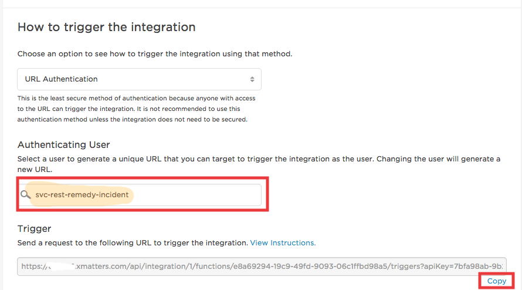
   </details>

* Once we have the URL, we want to paste everything starting with `/api...` into the `"triggerURL"` field for the `"pos":0` element.
   * We do this by editing the Constant like so: 
    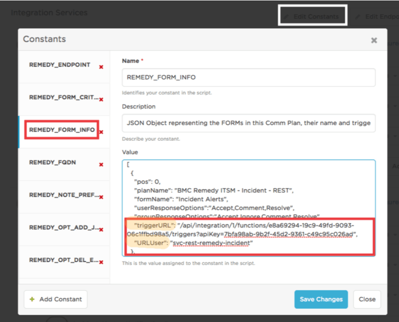
* Now, do the same thing for the "Initiate Incident Alerts with Bridge Form" Inbound Integration, and update the `"pos":1` element.
* Be sure to click the "Save Changes" button.
* When you are done, your `REMEDY_FORM_INFO` should contain something like this:

```javascript
[
  {
    "pos": 0,
    "planName": "BMC Remedy ITSM - Incident - REST - v6.1.1",
    "formName": "Incident Alerts",
    "userResponseOptions":"Accept,Comment,Resolve",
    "groupResponseOptions":"Accept,Ignore,Comment,Resolve",
     "triggerURL": "/api/integration/1/functions/e8a69294-19c9-49fd-9093-06c1ffbd98a5/triggers?apiKey=7bfa98ab-9b2f-45d2-9361-c49c95c026ad",
    "URLUser": "svc-rest-remedy-incident"
  },
  {
    "pos": 1,
    "planName": "BMC Remedy ITSM - Incident - REST - v6.1.1",
    "formName": "Incident Alerts with Bridge",
    "userResponseOptions":"Accept,Join,Comment,Resolve",
    "groupResponseOptions":"Accept,Ignore,Join,Comment,Resolve",
    "triggerURL": "/api/integration/1/functions/c7a99c60-ab67-48cc-94a6-24167e51afe5/triggers?apiKey=20888305-ed7e-4fc7-b5a6-6aa861a84c7f",
    "URLUser": "svc-rest-remedy-incident"
  }
]
```

    
#### Configure REMEDY\_FORM\_CRITERIA (Advanced, Optional Configuration)
**NOTE: THIS IS AN ADVANCED TOPIC, AND THE DEFAULT/OUT-OF-THE-BOX `REMEDY_FORM_CRITERIA` MAY BE SUITABLE TO START WITH**<br>
`REMEDY_FORM_CRITERIA` is used to decide at runtime what Form to initiate based on the value(s) of any named properties that are coming in from Remedy.  It relies on the information from `REMEDY_FORM_INFO` to know how to initiate a given Form by referencing the position of the specific form in the Array.

By default, an occurence of `"form":0` refers to the "Incident Alerts" Form, and an occurence of `"form":1` refers to the "Incident Alerts with Bridge" Form.

You do not have to modify `REMEDY_FORM_CRITERIA` if the out-of-the-box behavior works for you.

The default configuration operates as follows:

	* If the values from Remedy for
   		* `"impact"` is `"1-Extensive/Widespread"`, and 
    	* `"urgency"` is `"1-Critical"`, and 
    	* `"priority"` is `"Critical"`
    	
	* Then, initiate "Incident Alerts with Bridge" Form, and start a new xMatters Conference Bridge.
	
	* All other combinations will result in the non-bridge "Incident Alerts" Form.

Here is what the out-of-the-box contents of `REMEDY_FORM_CRITERIA` looks like:

   ```javascript
[
    {
        "defaultForm":0,
        "hasBridge":false
    },
    {
        "properties":{
            "impact":"1-Extensive/Widespread",
            "urgency":"1-Critical",
            "priority":"Critical"
            },
        "form":1,
        "hasBridge":true,
        "type":"BRIDGE",
        "useExisting":false,
        "existingEventPropFieldName":"",
        "existingEventValueFieldName":""
    },
    {
        "properties":{
            "impact":"1-Extensive/Widespread",
            "urgency":"2-High",
            "priority":"Critical"
            },
        "form":0,
        "hasBridge":false
    },
    {
        "properties":{
            "impact":"2-Significant/Large",
            "urgency":"1-Critical",
            "priority":"High"
            },
        "form":0,
        "hasBridge":false
    },
    {
        "properties":{
            "impact":"2-Significant/Large",
            "urgency":"2-High",
            "priority":"High"
            },
        "form":0,
        "hasBridge":false
    },
    {
        "properties":{
            "impact":"3-Moderate/Limited",
            "urgency":"1-Critical",
            "priority":"High"
            },
        "form":0,
        "hasBridge":false
    },
    {
        "properties":{
            "impact":"3-Moderate/Limited",
            "urgency":"2-High",
            "priority":"High"
            },
        "form":0,
        "hasBridge":false
    }
]
   
   ```

It basically says to use Form 0 as the default Form if nothing matches the definitions that follow.

The next six (6) elements define which Form to select for a variety of combinations of properites coming in from Remedy.

If you want to add or modify the existing elements, the field definitions are as follows:

* Element 0: Represents the default form, so has a special `"defaultForm"` field, whereas all other Elements use the field named `"form"` to determine which element of the `REMEDY_FORM_INFO` array to reference.
* Other than that, all elements are able to use the following fields:
 
| Field               | Description                                                                |
|:---------------------- |:-------------------------------------------------------------------------- |
| `"properties"` | (Required: object) A JavaScript Object that contains one or more field names and values.  The field name(s) (left of the colon in quotes) represent the name of fields that are being sent to xMatters from the Remedy Incident, and the values (right of the colon) are what to match against.  If all of the values coming from Remedy match the values defined here, then choose the form identified in the "form" field. |
| `"form"` | (Required: number) Represents the subscript into the `REMEDY_FORM_INFO` array to decide which Form to trigger.  A value of zero (0) refers to the first element in the array. |
| `"hasBridge"` | (Required: boolean, `true` or `false`) A flag that determines if a Conference Bridge is on the Form.  A value of `true` means that the Form has a Conference Bridge defined on its Layout, and a value of `false` means that the Form does not contain a Conference Bridge Defined on its layout. |
| `"type"` | (Required if `"hasBridge"` is `true`, must be `"BRIDGE"` or `"EXTERNAL"`)  If a conference bridge is required, then we need to know if we are configuring an xMatters Hosted Bridge (`"BRIDGE"`), or an External Bridge (`"EXTERNAL"`).  See [this](https://help.xmatters.com/ondemand/userguide/conferencebridging/create-conference-bridge.htm) page for information on creating Conference Bridges. |
| `"subType"` | (Required if `"type"` is `"EXTERNAL"`, and must be `"STATIC"` or `"DYNAMIC"`)  This identifies if the externally defined bridge information has a Bridge Number defined in its definition (`"STATIC"`), or if the Bridge Number is to be specified at run-time (`"DYNAMIC"`) |
| `"bridgeId"` | (Required if `"type"` is `"EXTERNAL"`) Name of pre-defined 3rd-party Conference Bridge object (e.g. "My Skype Priority 1 Bridge"). |
| `"bridgeNumber"` | (Required if `"subType"` is `"DYNAMIC"`, string) Digits representing bridge number (e.g. "13849348". |
| `"dialAfter"` | (Optional: string) digits or characters to dial after the bridgeNumber (e.g. "#" or ",,,#", etc). |
| `"useExisting"` | (Optional: boolean, `true` or `false`)  If present and `"hasBridge"` is `true`, then you can specify values for `"existingEventPropFieldName "` and `"existingEventValueFieldName"` to allow the script to lookup the information related to an existing/running Conference Bridge. |
| `"existingEventPropFieldName"` | (Optional: string)  If present and `"useExisting"` is `true`, then you can specify either `"eventId"` or the name of a property in the incoming payload from Remedy to get the Event Id for an existing event that will contain the running Conference Bridges details. |
| `"existingEventValueFieldName"` | (Optional: string)  If present and `"useExisting"` is `true`, then you use this field to specify the name of the field that can be used to lookup the running Event.<br>If `"existingEventPropFieldName"` = `eventId`, then the contents of the field named in `"existingEventValueFieldName"` will be an active xMatters Event Id.<br>Othewise, `"existingEventPropFieldName"` is the name of a Property in a running xMatters Event, and `"existingEventValueFieldName"` is the value to compare it to.<br>For example, `"existingEventPropFieldName"` may be "Incident ID" (the name of a Property in the Event to search for), and `"existingEventValueFieldName"` may be "incident_number" which will contain a Remedy Incident Number at runtime to search with (i.e. value of "incident_number" will match the value of "Incident ID" if found). |

Here's another way of thinking about how and when to specify the Conference Bridge details:

```
    hasBridge: {boolean} true | false
    
        IF "hasBridge" is true
        
            useExisting: {boolean} true | false
            
            type: {string} "EXTERNAL" | "BRIDGE"
            
                IF "EXTERNAL"
                    subType: {string} "STATIC" | "DYNAMIC"
                    bridgeId: {string} "Name of pre-defined 3rd-party Conference Bridge object"
                    IF "subType" is "DYNAMIC"
                        bridgeNumber: {string} "digits representing bridge number"
                    dialAfter: {string} (Optional) "digits or characters to dial after the bridgeNumber"
                        
                IF "BRIDGE"
                    No other properties are required.
                    IF "useExisting" is true
                        bridgeId: Will be resolved at run-time
                        
                IF "useExisting" is true
                    existingEventPropFieldName: {string} "eventId" | "<arbitrary-event-property-name>"
                    existingEventValueFieldName: {string} "<field-name-in-source-properties-with-existingEventPropFieldName-value>"
```

	
## <a name="rsu"></a>Remedy Setup
Configuring BMC Remedy to integrate with xMatters requires the following steps:

* Import the workflow definition files
* Configure filters
* Configure the ITSM user
* Disable automatic assignments

### <a name="riwdf"></a>Importing workflow definition files
* BMC's instructions are [here](https://docs.bmc.com/docs/ars91/en/importing-object-definitions-609072836.html)
* Copy the [Remedy.zip](Remedy.zip) file to the machine that has the BMC Remedy Developer Studio installed on it.
* Unzip the file which should expand our two Remedy Incident Workflow definition files ([xm_foumdation\_8\_1\_and\_above.def](Remedy/xm_foundation_8_1_and_above.def), and [xm_incident\_8\_1_and_above.def](Remedy/xm_incident_8_1_and_above.def))
* Log in to the BMC Remedy Developer Studio, and then select **File** > **Import**
* Select **BMC Remedy Developer Studio** > **Object Definitions**, and then click **Next**
* Select the AR System server into which you want to upload the integration objects, and then click **Next**
* Do one of the following:  
      Type in the location of the `xm_foundation_8_1_and_above.def` file  
      Click the Browse button to the right of the text field and navigate to the location of the `xm_foundation_8_1.def` file. Select the file, and then click **Open**.  
* Click **Next**  
      If you have already imported a workflow definition file, ensure that you select the Replace Objects on the Destination Server check box (do not select the other check boxes), but note that any changes you have made to those objects will be lost. If you are sure the changes you made are necessary for your installation, you will be required to re-apply those changes to the new version of the files being imported unless you applied those changes to overlay objects.  
* Repeat the above steps to import the `xm_incident_8_1_and_above.def` file.  
      Note this file must be imported after the foundation file.  
Click **Finish**

### <a name="rcf"></a>Configuring filters
The integration includes a filter that uses the Set Fields action to consume a web service; this object needs to have its endpoint changed to point to the inbound Web Hook URL of the Remedy 9 Incident Integration Service that is running in the Integration Agent that we previously configured in [Determine the Remedy 9 Integration Service entry point](#iris8).  The value will look something like this `http://<xmatters-agent-server-ip>:<SERVER_PORT>//API/INTEGRATION/1/FUNCTIONS/<INTEGRATION-UUID>/triggers?apiKey=<USER-UUID>`.

**Filter: XM:EI:EventInjection_100**
<kbd>
  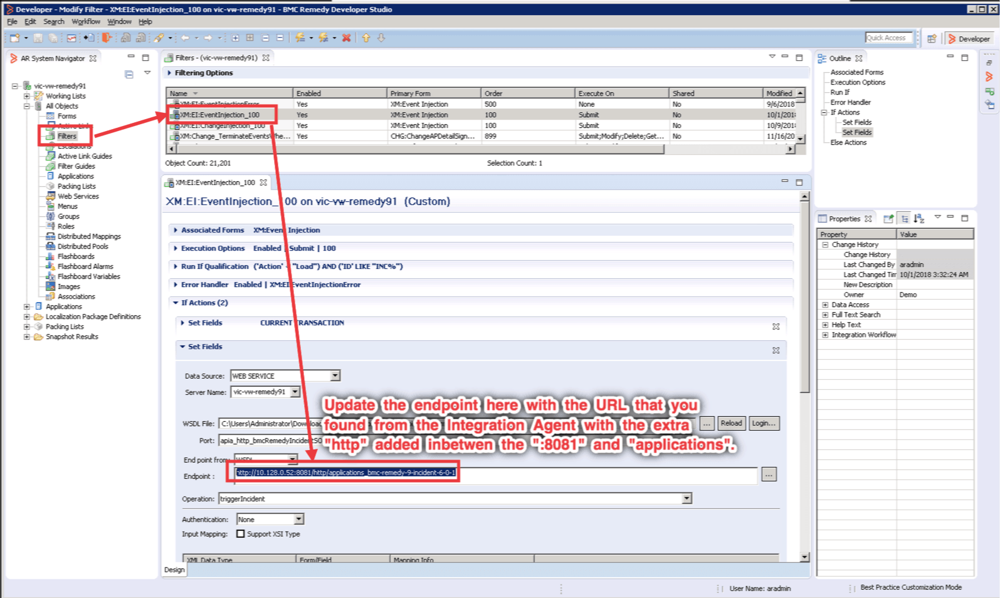
</kbd>

### <a name="rciu"></a>Configuring ITSM user
This the continuation of configuring the Remedy ITSM User that you created previously.

**Note: If you specify a Login ID of "xmatters" for this ITSM user, you can skip the following two update steps and proceed with [Disabling automatic assignment](#rdaa).**

#### Update the filter qualification
The XM:Incident_Re-Assigned_899 filter contains the following qualification criteria: `($USER$ != "xmatters")`  

This qualification prevents the integration from sending a second notification based on an incident's assignment changing because of a user response to an earlier notification. Replace `xmatters` with the name of the ITSM user created in Step One.

<kbd>
  
</kbd>

#### Update the default assignee
The out-of-box permissions allow the Submitter and Assignee (and BMC Remedy administrators) to search instances of the XM:Event Injection form. This allows users who modify incidents to see the corresponding XM:Event Injection instance for their update. To allow the ITSM user to also see all the Event Injection forms, modify the default value for the Assigned To field to the ITSM user you created.  

<kbd>
  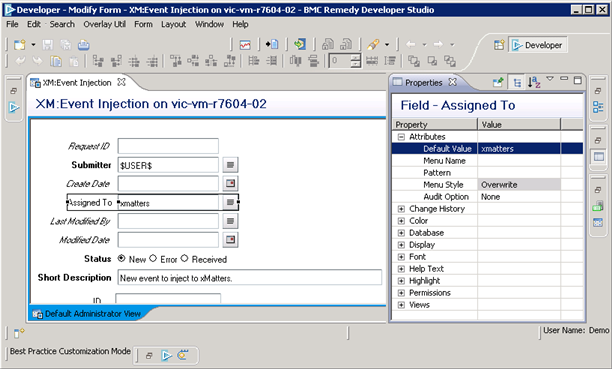
</kbd>

### <a name="rdaa"></a>Disabling automatic assignment
To allow xMatters to control assignments, you must turn off the automatic assignment feature in BMC Remedy.

**Note: To perform this step, you will need to login as a user with Administrator permission.**

* Log in to the BMC Remedy Mid Tier web server.
* Click **Applications**, and then click the **Application Console** left-menu item.
* Click **Application Administration Console**.
* In the new window, expand **Incident Management**, and then expand **Advanced Options**.
* Select **Rules**, and then click **Open**.
* Search for all existing "Configure Incident Rules".
* For each existing rule, do the following:  
      Select the rule, and in the **Assignment Process** drop-down list, select **(clear)**.  
      Click **Save**.  


# <a name="test"></a>5. Testing

## Triggering a notification
To trigger a notification, create a new incident with a priority of High or Critical in BMC Remedy, and assign it to
a user or group that exists in both BMC Remedy and xMatters:  

<kbd>
  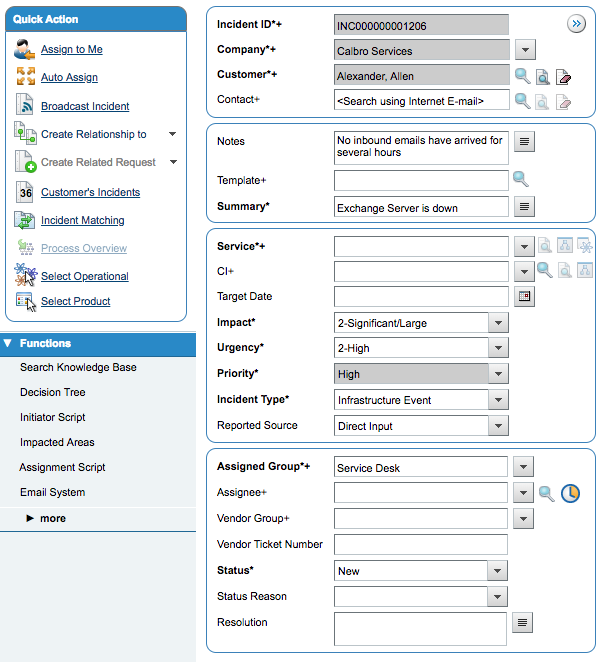
</kbd>

## Responding to a notification
In the following example, the notification is received on an Apple iPhone, but the process is similar for all devices.  

* Notifications appear in the application Inbox  

<kbd>
  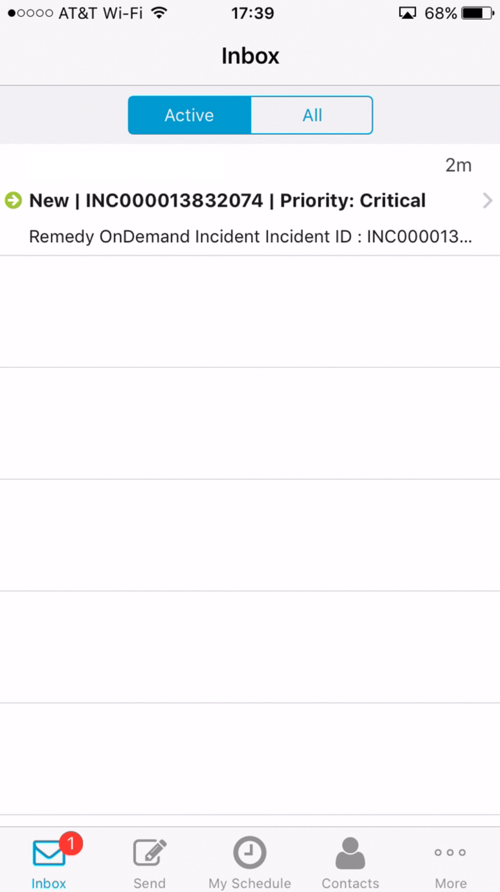
</kbd>  

* Opening the notification displays the details  

<kbd>
  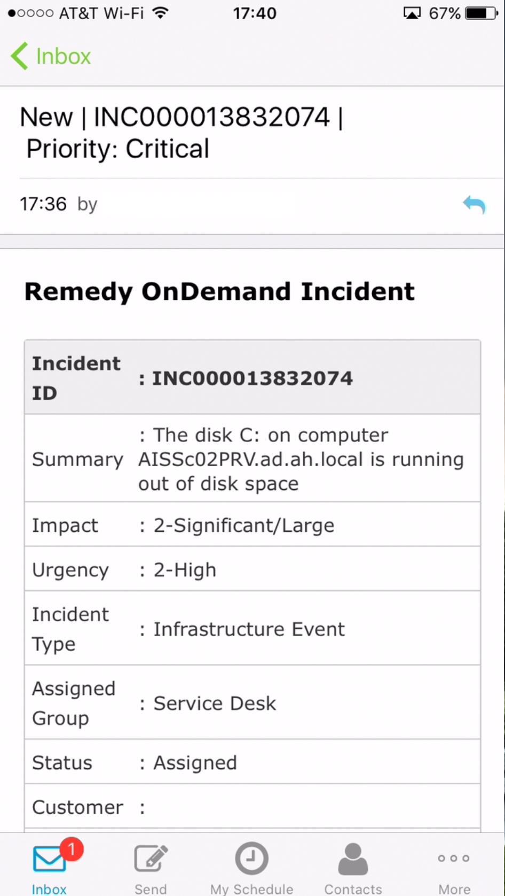
</kbd>  

* After viewing the details, either click the respond (blue return arrow) icon at the top or scroll to the bottom of the notification  

<kbd>
  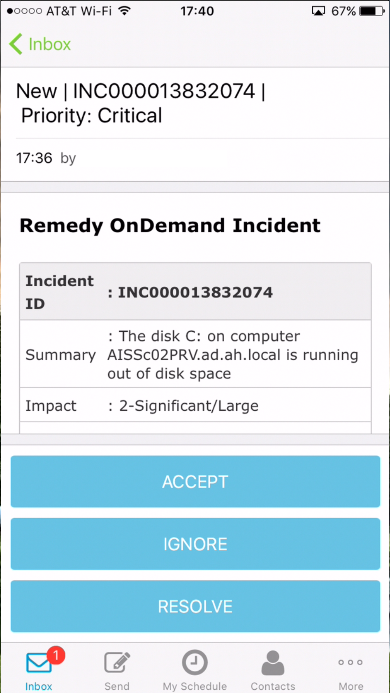
</kbd>  

* Tap the desired response, then tap **Respond now** or **Respond with comment**  

<kbd>
  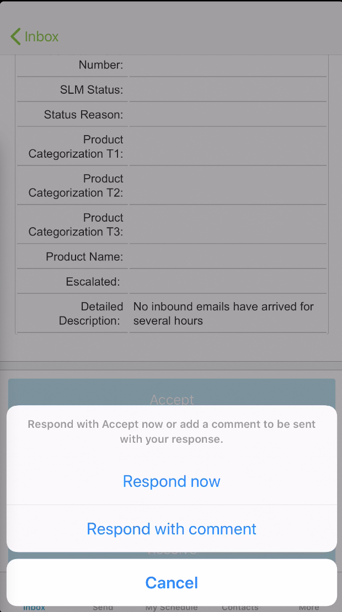
</kbd>  

* Here's a view of the same information via Email Notification:

<kbd>
  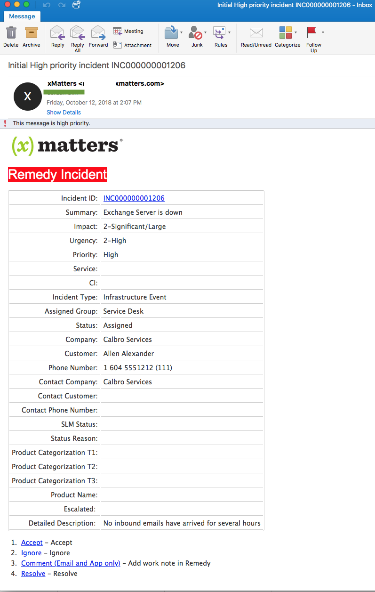
</kbd>

# <a name="tshoot"></a>6. Troubleshooting
If an xMatters notification was not received you can work backwards to determine where the issue may be:  
* Review the xMatters Reports tab and the specific [Event Log](http://help.xmatters.com/OnDemand/installadmin/reporting/eventlogreport.htm)  
* If no Event was created, review the [xMatters Inbound Integration Activity Stream](http://help.xmatters.com/OnDemand/xmodwelcome/integrationbuilder/activity-stream.htm)  
* If no activity was recorded, review the Remedy logs for a POST to xMatters
* If you see that Remedy POSTed to xMatters, next, inspect the logs from the Integration Agent that is listening for those requesets. (Search for "Exception", as well as "202" to detect if the integration was submitted to xMatters.